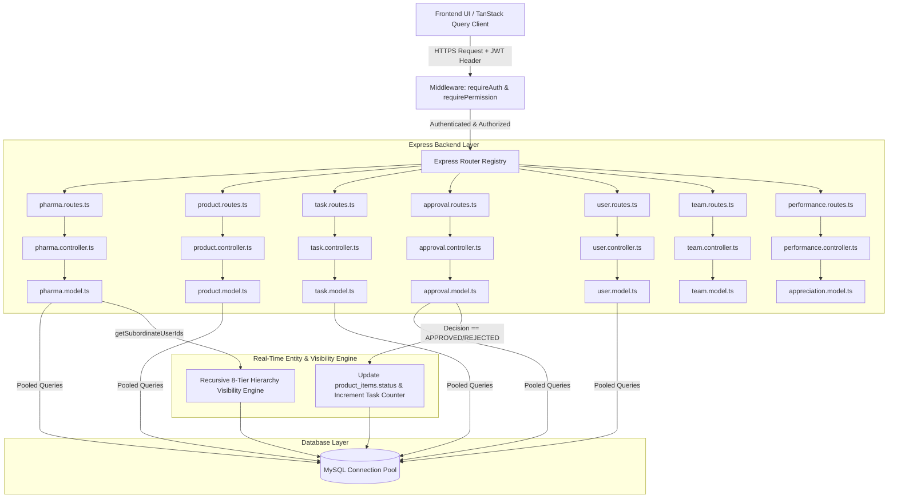

# ⚡ Deep Backend Architecture Map, Endpoint Catalog & Completion Report

This document provides a comprehensive, deep-dive architectural analysis of the Express.js & MySQL backend for **BMS MOMENTUM**. It catalogs **every single REST API endpoint**, its internal database dependencies, RBAC security requirements, cross-module event flows, future expansion scopes, implementation plan, and completion report.

---

## 🏛️ Backend Architectural Diagram & Pipeline

---

## 📡 Exhaustive REST API Endpoint Catalog & Dependency Mapping

### 1. Pharma Domain Operations & Working Pyramid (`backend/routes/pharma.routes.ts`)

| HTTP Method | Endpoint Path | RBAC Permission | Internal DB Dependencies (Tables) | Purpose & Payload Summary | Future Expansion Scope |
|:---|:---|:---|:---|:---|:---|
| `GET` | `/api/pharma/doctors` | `optionalAuth` / `requireAuth` | `doctors`, `profiles` | List doctors using Senior Pyramid Visibility (`getSubordinateUserIds`). | Add location GPS mapping and clinic operating hours. |
| `POST` | `/api/pharma/doctors` | `optionalAuth` / `requireAuth` | `doctors` | Create doctor entry (accessible to all field personnel). Includes family DOBs, special days, and gift tracking. | Add automated birthday/anniversary greeting triggers. |
| `PUT` | `/api/pharma/doctors/:id` | `requireAuth` (`admin`/`director`) | `doctors` | Admin & Director re-assignment of doctor entries to selected personnel. | Add audit logging on re-assignments. |
| `GET` | `/api/pharma/trade-entities` | `optionalAuth` / `requireAuth` | `trade_entities` | List Trade network firms with optional `category` filter (`chemist`, `wholesaler`, `distributor`). | Add GST validation API integration. |
| `POST` | `/api/pharma/trade-entities` | `optionalAuth` / `requireAuth` | `trade_entities` | Register new Chemist, Wholesaler, or Distributor firm (D.L., GST, Proprietor, Billing, Schemes). | Add credit limit breach alerts. |
| `GET` | `/api/pharma/daily-reports` | `optionalAuth` / `requireAuth` | `daily_reports`, `profiles` | List workstation activity reports with optional `user_id`, `date_from`, `date_to` filters. | Add monthly target achievement calculation. |
| `POST` | `/api/pharma/daily-reports` | `optionalAuth` / `requireAuth` | `daily_reports` | Submit daily activity report (Visits count, Billing, Payments, Offers, Achievements). | Add manager approval sign-off step. |
| `GET` | `/api/pharma/pharma-products`| `optionalAuth` / `requireAuth` | `pharma_products` | Fetch 3D Visual Detailing product catalog with MRP/PTR/PTS and active schemes. | Add AR (Augmented Reality) 3D model viewer support. |

---

### 2. Products & Entity Onboarding Module (`backend/routes/product.routes.ts`)

| HTTP Method | Endpoint Path | RBAC Permission | Internal DB Dependencies (Tables) | Purpose & Payload Summary | Future Expansion Scope |
|:---|:---|:---|:---|:---|:---|
| `GET` | `/api/products` | `products:read` | `products`, `product_form_schemas` | List product definitions with optional `product_type`, `category`, and `search` filters. | Add server-side pagination and tag filtering. |
| `GET` | `/api/products/types-categories` | `products:read` | `products` | Fetch distinct saved product types and categories. | Add hierarchy parent-child category mapping. |
| `POST` | `/api/products` | `products:manage` | `products` | Define a new product template with custom form schema & approval settings JSON. | Add versioning for product templates. |
| `GET` | `/api/products/form-schemas` | `products:read` | `product_form_schemas` | Fetch predefined onboarding and dependency form schemas. | Add visual drag-and-drop schema template library. |
| `GET` | `/api/products/tasks` | `products:read` | `product_tasks` | Fetch onboarding tasks and target quantity progress counters. | Add milestone due dates and notification alerts. |
| `POST` | `/api/products/tasks` | `products:manage` | `product_tasks` | Create onboarding task with a target goal. | Add automated task creation from sprint backlog. |
| `GET` | `/api/products/items` | `products:read` | `product_items`, `products` | List onboarded record instances with custom field values & statuses. | Add CSV/Excel export. |
| `POST` | `/api/products/items` | `products:onboard_item`| `product_items`, `approval_requests`, `product_tasks` | Onboard an entity instance under a product template; triggers approval if required. | Add batch entity CSV import parser. |
| `DELETE` | `/api/products/items/:id` | `products:manage` | `product_items`, `approval_requests`, `approval_actions` | Cascade delete onboarded item and linked approval requests/actions. | Add soft-delete archive flag and recovery. |
| `GET` | `/api/products/dependencies` | `products:read` | `product_dependencies`, `products` | List product relationships & interface dependency links. | Add dynamic topology dependency graph generator. |
| `POST` | `/api/products/dependencies` | `products:manage` | `product_dependencies` | Create product dependency link. | Add automated impact analysis. |
| `DELETE` | `/api/products/dependencies/:id` | `products:manage` | `product_dependencies` | Remove product dependency link. | Add audit log tracking. |
| `GET` | `/api/products/:id` | `products:read` | `products` | Fetch product definition by ID. | Add cache layer (Redis) for fast lookups. |
| `PUT` | `/api/products/:id` | `products:manage` | `products` | Update product definition schema, name, or approval settings. | Add change tracking & schema migration diffs. |
| `DELETE` | `/api/products/:id` | `products:manage` | `products`, `product_items`, `product_dependencies` | Delete product definition and clean up related records. | Add confirmation guard if active items exist. |

---

### 3. Multi-Stage Approval Engine (`backend/routes/approval.routes.ts`)

| HTTP Method | Endpoint Path | RBAC Permission | Internal DB Dependencies (Tables) | Purpose & Payload Summary | Future Expansion Scope |
|:---|:---|:---|:---|:---|:---|
| `GET` | `/api/approvals/workflows` | `approval:manage` | `approval_workflows`, `approval_steps` | List multi-step approval workflows and approver rules. | Add conditional branching based on form values. |
| `POST` | `/api/approvals/workflows` | `approval:manage` | `approval_workflows`, `approval_steps` | Create multi-step approval workflow. | Add SLA escalation rules. |
| `GET` | `/api/approvals/requests` | `approval:read` | `approval_requests`, `approval_steps`, `approval_workflows`, `profiles` | List pending and historical approval requests for current user/role. | Add delegation re-routing. |
| `POST` | `/api/approvals/requests` | `approval:manage` | `approval_requests` | Create approval request manually for a task or entity. | Add attachment support. |
| `POST` | `/api/approvals/requests/:id/action` | `approval:action` | `approval_requests`, `approval_actions`, `product_items`, `product_tasks` | **Core Sync Engine**: Submit decision (`approved`/`rejected`), advance step, & auto-sync `product_items.status`. | Add electronic signature verification. |
| `GET` | `/api/approvals/requests/:id` | `approval:read` | `approval_requests`, `approval_actions`, `profiles` | Fetch approval request details and step decision audit trail. | Add PDF approval certificate generation. |

---

### 4. Sprint & Agile Task Management (`backend/routes/task.routes.ts`)

| HTTP Method | Endpoint Path | RBAC Permission | Internal DB Dependencies (Tables) | Purpose & Payload Summary | Future Expansion Scope |
|:---|:---|:---|:---|:---|:---|
| `GET` | `/api/tasks` | `tasks:read` | `tasks`, `sprints`, `epics`, `profiles` | List tasks with filters for status, assignee, sprint, epic, team. | Add full-text search. |
| `POST` | `/api/tasks` | `tasks:manage` | `tasks` | Create agile task with story points and assignment. | Add sub-task hierarchy. |
| `GET` | `/api/tasks/sprints` | `sprints:read` | `sprints` | List planned, active, and completed sprints. | Add sprint velocity tracking over time. |
| `POST` | `/api/tasks/sprints` | `sprints:manage` | `sprints` | Create sprint with start/end dates and target points. | Add automated sprint capacity planner. |
| `GET` | `/api/tasks/epics` | `epics:read` | `epics` | List epics and grouped feature backlogs. | Add epic progress percentage indicators. |
| `POST` | `/api/tasks/epics` | `epics:manage` | `epics` | Create epic under a team. | Add epic roadmap timeline view. |
| `GET` | `/api/tasks/burndown/:sprintId` | `sprints:read` | `sprints`, `tasks` | Compute ideal vs actual remaining story points for burndown chart. | Add cumulative flow telemetry. |
| `PATCH` | `/api/tasks/:id/status` | `tasks:update_status` | `tasks`, `sprints` | Drag-and-drop quick status transition. | Add automated Slack webhooks. |
| `DELETE` | `/api/tasks/:id` | `tasks:manage` | `tasks` | Delete agile task. | Add undo delete buffer. |
