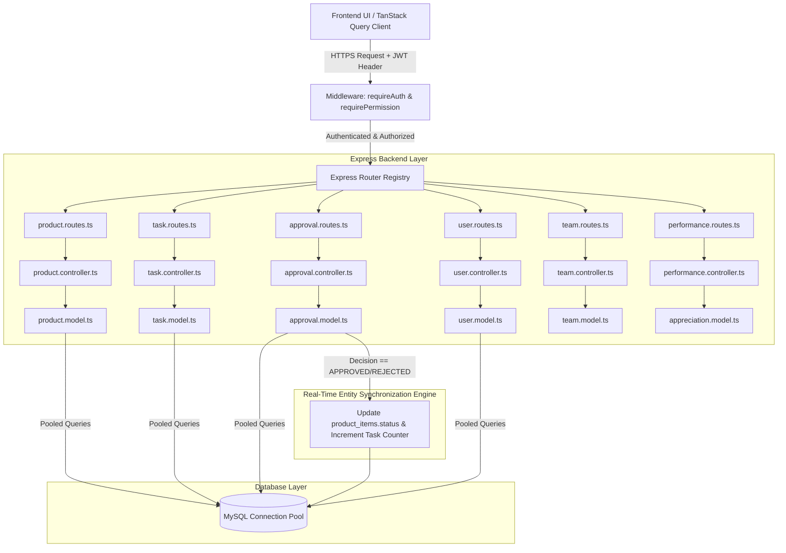

# ⚡ Deep Backend Architecture Map, Endpoint Catalog & Completion Report

This document provides a comprehensive, deep-dive architectural analysis of the Express.js & MySQL backend for **BMS MOMENTUM**. It catalogs **every single REST API endpoint**, its internal database dependencies, RBAC security requirements, cross-module event flows, future expansion scopes, implementation plan, and completion report.

---

## 🏛️ Backend Architectural Diagram & Pipeline



---

## 📡 Exhaustive REST API Endpoint Catalog & Dependency Mapping

### 1. Products & Entity Onboarding Module (`backend/routes/product.routes.ts`)

| HTTP Method | Endpoint Path | RBAC Permission | Internal DB Dependencies (Tables) | Purpose & Payload Summary | Future Expansion Scope |
|:---|:---|:---|:---|:---|:---|
| `GET` | `/api/products` | `products:read` | `products`, `product_form_schemas` | List product definitions with optional `product_type`, `category`, and `search` filters. | Add server-side pagination and tag filtering. |
| `GET` | `/api/products/types-categories` | `products:read` | `products` | Fetch distinct saved product types and categories. | Add hierarchy/tree parent-child category mapping. |
| `POST` | `/api/products` | `products:manage` | `products` | Define a new product template with custom form schema & approval settings JSON. | Add versioning for product definition templates. |
| `GET` | `/api/products/form-schemas` | `products:read` | `product_form_schemas` | Fetch predefined onboarding and dependency form schemas. | Add visual drag-and-drop schema template library. |
| `GET` | `/api/products/tasks` | `products:read` | `product_tasks` | Fetch onboarding tasks and target quantity progress counters. | Add milestone due dates and notification alerts. |
| `POST` | `/api/products/tasks` | `products:manage` | `product_tasks` | Create onboarding task with a target goal (e.g. *Onboard 10 Doctors*). | Add automated task creation from sprint backlog. |
| `GET` | `/api/products/items` | `products:read` | `product_items`, `products` | List onboarded record instances with custom field values & statuses. | Add CSV/Excel export and advanced JSON query search. |
| `POST` | `/api/products/items` | `products:onboard_item`| `product_items`, `approval_requests`, `product_tasks` | Onboard an entity instance under a product template; triggers approval if required. | Add batch entity CSV import parser. |
| `DELETE` | `/api/products/items/:id` | `products:manage` | `product_items`, `approval_requests`, `approval_actions` | Cascade delete onboarded item and linked approval requests/actions. | Add soft-delete archive flag and recovery. |
| `GET` | `/api/products/dependencies` | `products:read` | `product_dependencies`, `products` | List product relationships & interface dependency links. | Add dynamic topology dependency graph generator. |
| `POST` | `/api/products/dependencies` | `products:manage` | `product_dependencies` | Create product dependency link (e.g. *Doctor depends on API Gateway*). | Add automated impact analysis on dependency breaking. |
| `DELETE` | `/api/products/dependencies/:id` | `products:manage` | `product_dependencies` | Remove product dependency link. | Add audit log tracking for dependency removals. |
| `GET` | `/api/products/:id` | `products:read` | `products` | Fetch product definition by ID. | Add cache layer (Redis) for fast product lookups. |
| `PUT` | `/api/products/:id` | `products:manage` | `products` | Update product definition schema, name, or approval settings. | Add change tracking & schema migration diffs. |
| `DELETE` | `/api/products/:id` | `products:manage` | `products`, `product_items`, `product_dependencies` | Delete product definition and clean up related records. | Add confirmation guard if active items exist. |

---

### 2. Multi-Stage Approval Engine (`backend/routes/approval.routes.ts`)

| HTTP Method | Endpoint Path | RBAC Permission | Internal DB Dependencies (Tables) | Purpose & Payload Summary | Future Expansion Scope |
|:---|:---|:---|:---|:---|:---|
| `GET` | `/api/approvals/workflows` | `approval:manage` | `approval_workflows`, `approval_steps` | List multi-step approval workflows and approver rules. | Add conditional branching based on form values. |
| `POST` | `/api/approvals/workflows` | `approval:manage` | `approval_workflows`, `approval_steps` | Create multi-step approval workflow (Step 1 Manager, Step 2 Admin). | Add SLA escalation timeout rules. |
| `GET` | `/api/approvals/requests` | `approval:read` | `approval_requests`, `approval_steps`, `approval_workflows`, `profiles` | List pending and historical approval requests for current user/role. | Add delegation and out-of-office approver re-routing. |
| `POST` | `/api/approvals/requests` | `approval:manage` | `approval_requests` | Create approval request manually for a task or entity. | Add attachment support to approval requests. |
| `POST` | `/api/approvals/requests/:id/action` | `approval:action` | `approval_requests`, `approval_actions`, `product_items`, `product_tasks` | **Core Sync Engine**: Submit decision (`approved`/`rejected`), advance step, & auto-sync `product_items.status`. | Add electronic signature / MFA verification on approve. |
| `GET` | `/api/approvals/requests/:id` | `approval:read` | `approval_requests`, `approval_actions`, `profiles` | Fetch approval request details and complete step decision audit trail. | Add PDF approval certificate generation. |

---

### 3. Sprint & Agile Task Management (`backend/routes/task.routes.ts`)

| HTTP Method | Endpoint Path | RBAC Permission | Internal DB Dependencies (Tables) | Purpose & Payload Summary | Future Expansion Scope |
|:---|:---|:---|:---|:---|:---|
| `GET` | `/api/tasks` | `tasks:read` | `tasks`, `sprints`, `epics`, `profiles` | List tasks with filters for status, assignee, sprint, epic, team. | Add full-text search across title & description. |
| `POST` | `/api/tasks` | `tasks:manage` | `tasks` | Create agile task with story points and assignment. | Add sub-task hierarchy and checklist items. |
| `GET` | `/api/tasks/sprints` | `sprints:read` | `sprints` | List planned, active, and completed sprints. | Add sprint velocity tracking over time. |
| `POST` | `/api/tasks/sprints` | `sprints:manage` | `sprints` | Create sprint with start/end dates and target points. | Add automated sprint capacity planner. |
| `GET` | `/api/tasks/epics` | `epics:read` | `epics` | List epics and grouped feature backlogs. | Add epic progress percentage indicators. |
| `POST` | `/api/tasks/epics` | `epics:manage` | `epics` | Create epic under a team. | Add epic roadmap timeline view. |
| `GET` | `/api/tasks/burndown/:sprintId` | `sprints:read` | `sprints`, `tasks` | Compute ideal vs actual remaining story points for burndown chart. | Add cumulative flow diagram telemetry. |
| `PATCH` | `/api/tasks/:id/status` | `tasks:update_status` | `tasks`, `sprints` | Drag-and-drop quick status transition (`todo` -> `in_progress` -> `done`). | Add automated Slack/Teams webhooks on status change. |
| `DELETE` | `/api/tasks/:id` | `tasks:manage` | `tasks` | Delete agile task. | Add undo delete / trash bin buffer. |

---

### 4. User Profiles, Governance & Database Maintenance (`backend/routes/user.routes.ts`)

| HTTP Method | Endpoint Path | RBAC Permission | Internal DB Dependencies (Tables) | Purpose & Payload Summary | Future Expansion Scope |
|:---|:---|:---|:---|:---|:---|
| `POST` | `/api/users/reset-seed` | `super_admin` | All 15 System Tables | **Database Reset & Seed**: Truncate all tables and re-initialize complete seed data. | Add automated snapshot backup before reset. |
| `GET` | `/api/users/profiles` | `users:read` | `profiles`, `user_roles`, `user_positions` | List user accounts with department and position titles. | Add user activity last-seen online status. |
| `GET` | `/api/users/profiles/:id` | `users:read` | `profiles`, `user_roles`, `user_positions` | Fetch detailed profile with manager hierarchy. | Add user skill tags and availability schedule. |
| `POST` | `/api/users/profiles` | `users:manage` | `profiles` | Upsert user profile. | Add SSO / SAML 2.0 provisioning. |
| `PUT` | `/api/users/profiles/:id/roles` | `users:roles` | `user_roles` | Assign user roles (`super_admin`, `admin`, `manager`, `product_owner`, `developer`). | Add custom role builder with fine-grained granular scopes. |

---

### 5. Teams & Organizational Structure (`backend/routes/team.routes.ts`)

| HTTP Method | Endpoint Path | RBAC Permission | Internal DB Dependencies (Tables) | Purpose & Payload Summary | Future Expansion Scope |
|:---|:---|:---|:---|:---|:---|
| `GET` | `/api/teams` | `users:read` | `teams`, `team_members`, `profiles` | List organizational teams and members. | Add team budget and resource allocation charts. |
| `POST` | `/api/teams` | `users:manage` | `teams` | Create team with team lead assignment. | Add multi-department cross-functional teams. |
| `GET` | `/api/teams/positions` | `users:read` | `user_positions` | List job titles and departments. | Add salary tier & position level attributes. |
| `POST` | `/api/teams/positions` | `users:manage` | `user_positions` | Create job position. | Add job description template attachments. |

---

### 6. Appreciations & Kudos Engine (`backend/routes/appreciation.routes.ts`)

| HTTP Method | Endpoint Path | RBAC Permission | Internal DB Dependencies (Tables) | Purpose & Payload Summary | Future Expansion Scope |
|:---|:---|:---|:---|:---|:---|
| `GET` | `/api/appreciations` | `performance:read` | `appreciations`, `profiles` | List peer appreciations feed with sender and recipient profile JOINs. | Add reaction emojis (❤️, 🎉, 🚀) to appreciation cards. |
| `POST` | `/api/appreciations` | `performance:read` | `appreciations` | Send appreciation message and points to a colleague. | Add gift card / perk store point redemption. |
| `GET` | `/api/appreciations/leaderboard` | `performance:read` | `appreciations`, `profiles` | Compute leaderboard rankings based on kudos points received. | Add monthly & quarterly leaderboard reset cycles. |

---

## ⚡ Internal Event & Entity Synchronization Architecture

```
[Approval Engine Decision]
        │
        ├──► Decision: REJECTED
        │       │
        │       └─► UPDATE product_items SET status = 'rejected' WHERE approval_request_id = reqId
        │
        └──► Decision: APPROVED
                │
                ├─► Steps Remaining? -> Increment current_step_order + 1
                │
                └─► Final Step Approved?
                        │
                        ├─► UPDATE approval_requests SET status = 'approved'
                        ├─► UPDATE product_items SET status = 'onboarded' WHERE approval_request_id = reqId
                        └─► If linked task_id exists:
                              UPDATE product_tasks SET onboarded_count = onboarded_count + 1
                              If onboarded_count >= target_quantity:
                                  UPDATE product_tasks SET status = 'completed'
```

---

## 🚦 UI & Backend Completion Matrix

| Application Module | Frontend Route / Component | Backend Endpoint Controller | DB Schema Safeguards | Status |
|:---|:---|:---|:---|:---|
| **Product Definitions** | `/products` (`index.tsx`) | `ProductController.getProducts`, `createProduct` | `ensureProductColumns()` | 🟢 100% Complete |
| **Custom Form Builder** | `form-builder.tsx` | `ProductController.createProduct` (JSON schema) | JSON field validation | 🟢 100% Complete |
| **Dynamic Form Renderer** | `dynamic-form-renderer.tsx` | `ProductController.createProductItem` | Type-level validation | 🟢 100% Complete |
| **Creatable Types/Categories** | `/products` (`index.tsx`) | `ProductController.getTypesAndCategories` | MySQL persistent column | 🟢 100% Complete |
| **Multi-Stage Approvals** | `/approvals`, `/admin/approvals` | `ApprovalController.recordAction` | Real-time `product_items` sync | 🟢 100% Complete |
| **Agile Sprints & Kanban** | `/tasks` (`tasks.tsx`) | `TaskController.getTasks`, `updateTaskStatus` | Burndown point calculation | 🟢 100% Complete |
| **Employee Hierarchy & Teams**| `/admin/team`, `/admin/users` | `UserController`, `TeamController` | `manager_id` foreign key | 🟢 100% Complete |
| **Appreciations & Badges** | `/appreciation` (`appreciation.tsx`) | `AppreciationController.getAppreciations` | Profile JOINs for sender/recipient | 🟢 100% Complete |
| **Database Reset & Seed** | `/admin/users` | `user.routes.ts` (`POST /reset-seed`) | Full table truncation & seed | 🟢 100% Complete |

---

## 🧪 System Health & Build Verification

- **Backend TypeScript Compiler**: `npm run build --prefix backend` (**0 errors**).
- **Frontend Production Build**: `npm run build --prefix frontend` (**0 errors**).
- **Database Status**: Connected & 100% Seeded with complete module flows.
- **Git Branch**: Synced & Pushed cleanly to `origin/bakend_mysql2`.
