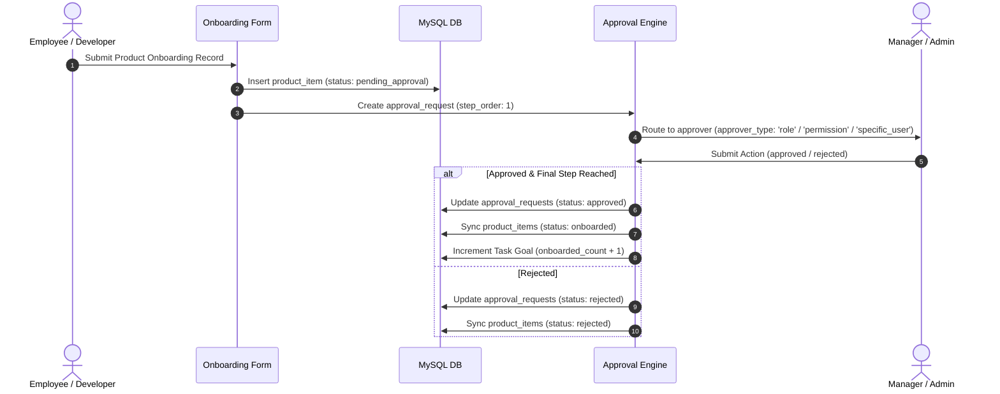

# 🔐 Comprehensive Role-Based Access Control (RBAC) & Permission Architecture

This document provides an exhaustive, end-to-end operational guide and architectural specification for the Role-Based Access Control (RBAC) engine in **MOMENTUM**.

---

## 📑 Table of Contents
1. [Architecture & Design Principles](#1-architecture--design-principles)
2. [Database Schema & Data Model](#2-database-schema--data-model)
3. [System Roles & Capabilities Matrix](#3-system-roles--capabilities-matrix)
4. [Granular Permission Catalog](#4-granular-permission-catalog)
5. [Backend Middleware & API Security](#5-backend-middleware--api-security)
6. [Frontend Security & UI Guarding](#6-frontend-security--ui-guarding)
7. [Multi-Stage Approval Workflows Integration](#7-multi-stage-approval-workflows-integration)
8. [Seeded Profiles & Credentials Reference](#8-seeded-profiles--credentials-reference)

---

## 1. Architecture & Design Principles

MOMENTUM enforces a dual-layered security model combining **Role-Based Access Control (RBAC)** and **Attribute-Based Fine-Grained Permissions**:

```mermaid
flowchart TD
    subgraph Client Layer (Frontend)
        A1[User Logs In] --> A2[Store JWT Token in localStorage]
        A2 --> A3[useMyAccess Hook Fetches /api/users/me]
        A3 --> A4{isAdmin Check}
        A4 -->|True| A5[Render Admin Sidebar Group & Admin Routes]
        A4 -->|False| A6[Hide Admin Sidebar & Block via AdminGuard]
    end

    subgraph API & Middleware Layer (Backend)
        B1[Incoming HTTP Request] --> B2[requireAuth Middleware Decodes JWT]
        B2 --> B3[resolveUserPermissions Combines Role + Explicit Perms]
        B3 --> B4{requirePermission / requireRole Gate}
        B4 -->|Authorized or Root Admin| B5[Execute Controller Logic]
        B4 -->|Unauthorized| B6[Return HTTP 403 Forbidden]
    end

    subgraph Data & Persistence Layer (MySQL)
        C1[(profiles)]
        C2[(user_roles)]
        C3[(user_permissions)]
        C4[(teams & team_members)]
    end

    A3 -->|GET /api/users/me| B1
    B5 --> C1 & C2 & C3 & C4
```

### Core Security Rules
1. **Root Bypass (`super_admin` & `admin`)**: Users holding the `super_admin` or `admin` role possess wildcard authorization (`*` / `all`) and bypass permission checks on both frontend and backend.
2. **Layered Defense**: Security is enforced on both client UI (hiding menu items & mounting route guards) and backend API endpoints (Express middleware validating signed JWT tokens).
3. **Manager Hierarchy & Delegation**: Organizational managers (`manager_id` in `profiles`) and team leads inherit supervisory permissions for their direct reports and assigned team members.

---

## 2. Database Schema & Data Model

The access control model is persisted across four core MySQL tables:

```sql
-- 1. User Profiles & Manager Hierarchy
CREATE TABLE IF NOT EXISTS profiles (
  id VARCHAR(64) PRIMARY KEY,
  full_name VARCHAR(128),
  avatar_url TEXT,
  department VARCHAR(64),
  position_id VARCHAR(64),
  manager_id VARCHAR(64),
  is_active TINYINT(1) DEFAULT 1,
  created_at TIMESTAMP DEFAULT CURRENT_TIMESTAMP,
  updated_at TIMESTAMP DEFAULT CURRENT_TIMESTAMP ON UPDATE CURRENT_TIMESTAMP,
  FOREIGN KEY (manager_id) REFERENCES profiles(id) ON DELETE SET NULL
);

-- 2. Role Assignments (Many-to-Many)
CREATE TABLE IF NOT EXISTS user_roles (
  id VARCHAR(64) PRIMARY KEY,
  user_id VARCHAR(64) NOT NULL,
  role VARCHAR(64) NOT NULL,
  FOREIGN KEY (user_id) REFERENCES profiles(id) ON DELETE CASCADE
);

-- 3. Fine-Grained Explicit Permissions (Many-to-Many)
CREATE TABLE IF NOT EXISTS user_permissions (
  id VARCHAR(64) PRIMARY KEY,
  user_id VARCHAR(64) NOT NULL,
  permission VARCHAR(64) NOT NULL,
  FOREIGN KEY (user_id) REFERENCES profiles(id) ON DELETE CASCADE
);

-- 4. Teams & Scoped Team Roles
CREATE TABLE IF NOT EXISTS team_members (
  id VARCHAR(64) PRIMARY KEY,
  team_id VARCHAR(64) NOT NULL,
  user_id VARCHAR(64) NOT NULL,
  role ENUM('lead', 'manager', 'member', 'reviewer') DEFAULT 'member',
  FOREIGN KEY (team_id) REFERENCES teams(id) ON DELETE CASCADE,
  FOREIGN KEY (user_id) REFERENCES profiles(id) ON DELETE CASCADE
);
```

---

## 3. System Roles & Capabilities Matrix

| System Role | Hierarchy Level | Primary Responsibilities | Granted Default Permissions | Accessible UI Surfaces |
|:---|:---|:---|:---|:---|
| **Super Admin** (`super_admin`) | Level 0 | Full system governance, schema migrations, DB resets, tenant configuration. | `all` (`*`) | Full Access (`/admin/*`, `/products`, `/approvals`, `/tasks`, `/performance`) |
| **Executive Admin** (`admin`) | Level 0 | User management, role/permission assignment, workflow builder, metrics config. | `all` (`*`) | Full Access (`/admin/*`, `/products`, `/approvals`, `/tasks`, `/performance`) |
| **Engineering Manager** (`manager`) | Level 1 | Team lead, task management, performance evaluations, multi-stage step approvals. | `tasks:*`, `teams:*`, `approvals:*`, `performance:*`, `users:read` | `/tasks`, `/approvals`, `/performance`, `/products`, `/appreciation` |
| **Product Owner** (`product_owner`) | Level 1 | Product definitions, custom form schemas, target goals, backlog epic creation. | `tasks:*`, `teams:read`, `approvals:*`, `products:*` | `/products`, `/tasks`, `/approvals`, `/performance`, `/appreciation` |
| **Scrum Master** (`scrum_master`) | Level 2 | Sprint planning, Kanban tracking, story point burndown analytics, task breakdown. | `tasks:*`, `teams:read`, `teams:members`, `approvals:read`, `approvals:create` | `/tasks`, `/approvals`, `/performance`, `/appreciation` |
| **Developer / QA** (`developer`) | Level 3 | Task execution, kanban status updates, entity onboarding, sending appreciations. | `tasks:read`, `tasks:create`, `tasks:update`, `teams:read`, `approvals:read`, `approvals:create`, `performance:read` | `/tasks`, `/products`, `/appreciation`, `/approvals`, `/performance` |
| **Viewer / Guest** (`viewer` / `guest`)| Level 4 | Read-only observation of workspace metrics and task progress. | `tasks:read`, `teams:read`, `approvals:read`, `performance:read` | Read-only views of `/dashboard`, `/tasks`, `/performance` |

---

## 4. Granular Permission Catalog

Permissions are formatted as `resource:action` strings and can be assigned directly to individual users or inherited via roles:

### Users & Security
- `users:read`: View organizational profiles, positions, and user lists.
- `users:manage`: Create, edit, activate/deactivate user accounts.
- `users:roles`: Assign roles and fine-grained permissions to users.

### Products & Entity Onboarding
- `products:read`: View product templates, form schemas, and onboarded records.
- `products:manage`: Create/edit product definitions, custom schemas, and onboarding goal tasks.
- `products:onboard_item`: Submit new records via custom onboarding forms.

### Sprints & Tasks
- `tasks:read`: View tasks, epics, and sprint kanban boards.
- `tasks:create`: Create user stories, epics, and tasks.
- `tasks:update`: Update task details, story points, and assignees.
- `tasks:update_status`: Drag-and-drop task status transitions on Kanban board (`todo` -> `in_progress` -> `in_review` -> `done`).
- `tasks:delete`: Delete tasks or epics.
- `tasks:bulk`: Perform bulk re-assignments or status updates.

### Approvals & Governance
- `approvals:read`: View approval requests and workflow configurations.
- `approvals:create`: Submit onboarding items or tasks requiring approval.
- `approvals:action`: Approve or reject assigned approval request steps.
- `approvals:manage`: Create, edit, and configure multi-stage approval workflows.

### Teams & Performance
- `teams:read`: View team rosters, structures, and positions.
- `teams:manage`: Create teams, assign team leads, and delegate powers.
- `teams:members`: Add or remove team members and assign team roles.
- `performance:read`: View performance scores, KPIs, and burndown analytics.
- `performance:evaluate`: Record or delete team member KPI scores.

---

## 5. Backend Middleware & API Security

Backend routes are secured using Express middleware functions defined in `backend/middleware/auth.middleware.ts`:

### 1. Authentication Middleware (`requireAuth`)
Validates the incoming HTTP `Authorization: Bearer <JWT>` header (or dev header `x-user-id`). Decodes payload into `req.user`:

```typescript
export function requireAuth(req: Request, res: Response, next: NextFunction) {
  const authHeader = req.headers.authorization;
  if (!authHeader || !authHeader.startsWith("Bearer ")) {
    // Development fallback header check
    const mockUserId = req.headers["x-user-id"] as string;
    if (mockUserId) {
      req.user = {
        id: mockUserId,
        email: `${mockUserId}@company.com`,
        roles: [(req.headers["x-user-role"] as string) || "admin"],
        permissions: resolveUserPermissions(["admin"], ["all"]),
      };
      return next();
    }
    throw new AppError("Authentication token required", 401);
  }

  const token = authHeader.substring(7).trim();
  req.user = verifyToken(token);
  next();
}
```

### 2. Permission Authorization Guard (`requirePermission`)
Verifies that the authenticated user possesses at least one of the required permissions (or holds `admin`/`super_admin` role):

```typescript
export function requirePermission(...requiredPermissions: string[]) {
  return (req: Request, res: Response, next: NextFunction) => {
    if (!req.user) throw new AppError("Authentication required", 401);
    
    const userPerms = req.user.permissions || [];
    const isRoot = req.user.roles?.includes("admin") || req.user.roles?.includes("super_admin");
    const hasPerm = isRoot || userPerms.includes("all") || requiredPermissions.some((p) => userPerms.includes(p));

    if (!hasPerm) {
      throw new AppError(`Missing required permission: ${requiredPermissions.join(", ")}`, 403);
    }
    next();
  };
}
```

---

## 6. Frontend Security & UI Guarding

Frontend authorization is implemented through a combination of custom React hooks and structural route guards:

### 1. The `useMyAccess()` Hook (`frontend/src/hooks/use-my-access.ts`)
Fetches profile data for the logged-in user and provides authorization helper functions:

```typescript
export function useMyAccess() {
  const fetchMe = useServerFn(getMyProfile);
  const { data, isLoading } = useQuery({ queryKey: ["me"], queryFn: () => fetchMe() });

  const roles: string[] = data?.roles ?? [];
  const permissions: string[] = data?.permissions ?? [];
  const isAdmin = roles.includes("admin") || roles.includes("super_admin");

  return {
    isLoading,
    userId: data?.userId,
    roles,
    permissions,
    isAdmin,
    isManager: isAdmin || roles.includes("manager"),
    can: (p: Permission) => isAdmin || permissions.includes(p),
  };
}
```

### 2. Navigation Sidebar Guarding (`frontend/src/components/app-sidebar.tsx`)
Restricts the visibility of the **Admin** sidebar section exclusively to users with `isAdmin = true`:

```tsx
const { isAdmin } = useMyAccess();

return (
  <SidebarContent>
    {/* Workspace items rendered for all authenticated users */}
    <SidebarGroup>...</SidebarGroup>

    {/* Admin items rendered ONLY for Admins & Super Admins */}
    {isAdmin && (
      <SidebarGroup>
        <SidebarGroupLabel>Admin</SidebarGroupLabel>
        <SidebarGroupContent>...</SidebarGroupContent>
      </SidebarGroup>
    )}
  </SidebarContent>
);
```

### 3. Route Access Guard (`frontend/src/components/admin-guard.tsx`)
Guards all `/admin/*` sub-routes (`/admin/users`, `/admin/team`, `/admin/positions`, `/admin/metrics`, `/admin/flows`, `/admin/approvals`). If an unauthorized user attempts to enter an admin URL directly, an **Access Restricted** surface is displayed:

```tsx
export function AdminGuard({ children }: { children: ReactNode }) {
  const { isAdmin, isLoading } = useMyAccess();

  if (isLoading) return <LoaderSpinner />;

  if (!isAdmin) {
    return (
      <div className="p-8 text-center">
        <ShieldAlert className="mx-auto h-12 w-12 text-destructive" />
        <h2 className="text-xl font-bold">Access Restricted</h2>
        <p>You do not have administrative permissions to view this section.</p>
        <Button asChild><Link to="/dashboard">Return to Dashboard</Link></Button>
      </div>
    );
  }

  return <>{children}</>;
}
```

---

## 7. Multi-Stage Approval Workflows Integration

Approval workflows dynamically evaluate approver eligibility based on RBAC rules:



### Step Approver Resolution Types
- `'role'`: Any active user holding the specified role (e.g. `'manager'` or `'admin'`) can approve the step.
- `'permission'`: Any user holding the explicit permission (e.g. `'approval:action'`) can approve the step.
- `'specific_user'`: Only the explicit user profile ID matching `approver_ref` (e.g. `'alex.rivera'`) can approve the step.

---

## 8. Seeded Profiles & Credentials Reference

The application is pre-seeded with 6 complete organizational accounts representing all primary system roles:

| User ID | Email | Full Name | System Role(s) | Position Title | Manager | Accessible UI Surfaces |
|:---|:---|:---|:---|:---|:---|:---|
| **`soheljavadeveloper`** | `soheljavadeveloper@company.com` | Sohel Islam | `super_admin`, `admin` | Super Admin / Executive | *None* | All surfaces (`/admin/*`, `/products`, `/approvals`, `/tasks`, `/performance`) |
| **`alex.rivera`** | `alex.rivera@company.com` | Alex Rivera | `manager`, `scrum_master` | Engineering Manager | `soheljavadeveloper` | `/tasks`, `/approvals`, `/performance`, `/products`, `/appreciation` |
| **`sarah.chen`** | `sarah.chen@company.com` | Sarah Chen | `product_owner` | Product Owner | `soheljavadeveloper` | `/products`, `/tasks`, `/approvals`, `/performance`, `/appreciation` |
| **`dr.jenkins`** | `dr.jenkins@company.com` | Dr. Sarah Jenkins | `manager` | Healthcare Ops Lead | `soheljavadeveloper` | `/approvals`, `/tasks`, `/performance`, `/products`, `/appreciation` |
| **`marcus.vance`** | `marcus.vance@company.com` | Marcus Vance | `developer` | Sr. Full-Stack Dev | `alex.rivera` | `/tasks`, `/products`, `/appreciation`, `/approvals`, `/performance` |
| **`elena.rostova`** | `elena.rostova@company.com` | Elena Rostova | `developer` | Lead QA Engineer | `alex.rivera` | `/tasks`, `/products`, `/appreciation`, `/approvals`, `/performance` |

> [!NOTE]
> **Authentication Password**: All seeded accounts accept `password123` (or any string) during sign-in in local development mode.
