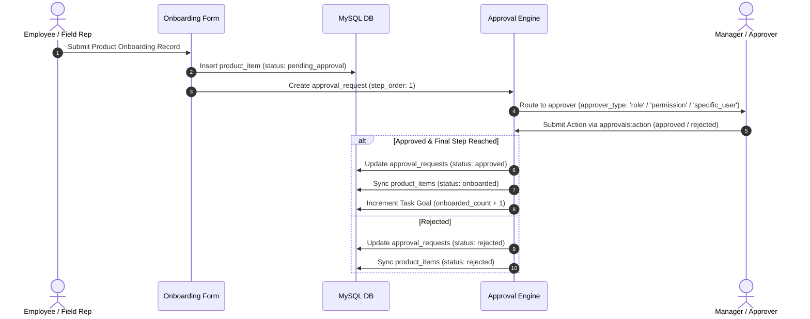

# 🔐 Comprehensive Role-Based Access Control (RBAC) & Permission Architecture

This document provides an exhaustive, end-to-end operational guide and architectural specification for the Role-Based Access Control (RBAC) engine in **MOMENTUM**.

---

## 📑 Table of Contents
1. [Architecture & Design Principles](#1-architecture--design-principles)
2. [Database Schema & Data Model](#2-database-schema--data-model)
3. [System Roles & Capabilities Matrix](#3-system-roles--capabilities-matrix)
4. [Granular Permission Catalog](#4-granular-permission-catalog)
5. [Backend Middleware & API Security](#5-backend-middleware--api-security)
6. [Frontend Security & UI Guarding](#6-frontend-security--ui-guarding)
7. [Multi-Stage Approval Workflows Integration](#7-multi-stage-approval-workflows-integration)
8. [The 8-Tier Working Pyramid & Seeded Credentials Reference](#8--the-8-tier-working-pyramid--seeded-credentials-reference)

---

## 1. Architecture & Design Principles

MOMENTUM enforces a dual-layered security model combining **Role-Based Access Control (RBAC)** and **Attribute-Based Fine-Grained Permissions**:

```mermaid
flowchart TD
    subgraph Client Layer (Frontend)
        A1[User Logs In] --> A2[Store Signed JWT in localStorage & Cookie]
        A2 --> A3[useMyAccess Hook Fetches /api/auth/me]
        A3 --> A4{isAdmin Check}
        A4 -->|True| A5[Render Admin Sidebar Group & Admin Routes]
        A4 -->|False| A6[Hide Admin Sidebar & Block via AdminGuard]
    end

    subgraph API & Middleware Layer (Backend)
        B1[Incoming HTTP Request] --> B2[requireAuth Middleware Decodes Signed JWT]
        B2 --> B3[resolveUserPermissions Combines Role + Explicit Perms]
        B3 --> B4{requirePermission / requireRole Gate}
        B4 -->|Authorized or Root Admin| B5[Execute Controller Logic]
        B4 -->|Unauthorized| B6[Return HTTP 403 Forbidden]
    end

    subgraph Data & Persistence Layer (MySQL)
        C1[(profiles)]
        C2[(user_roles)]
        C3[(user_permissions)]
        C4[(teams & team_members)]
    end

    A3 -->|GET /api/auth/me| B1
    B5 --> C1 & C2 & C3 & C4
```

### Core Security Rules
1. **Root Authorization (`super_admin`, `admin`, `director`, `gm`)**: Holding system administrative or board-level roles grants default operational access across features.
2. **Compliance & Audit Guarding**: High-compliance operational actions (e.g. multi-stage financial clearances or clinical sign-offs) require exact named permissions (`approvals:action`) rather than reliance on implicit root bypasses.
3. **Strict Production Environment Isolation**: Mock/fallback authorization headers (`x-user-id`) are strictly rejected in production environments (`process.env.NODE_ENV === "production"`).
4. **Recursive Senior Hierarchy Filtering (`getSubordinateUserIds`)**: Data visibility on operational endpoints (`/doctors`, `/trade-entities`, `/daily-reports`) is restricted by default to records created by or assigned to the user or their subordinate management tree (`manager_id` CTE).

---

## 2. Database Schema & Data Model

The access control model is persisted across four core MySQL tables:

```sql
-- 1. User Profiles & Manager Hierarchy
CREATE TABLE IF NOT EXISTS profiles (
  id VARCHAR(64) PRIMARY KEY,
  full_name VARCHAR(128),
  avatar_url TEXT,
  department VARCHAR(64),
  position_id VARCHAR(64),
  manager_id VARCHAR(64),
  is_active TINYINT(1) DEFAULT 1,
  email VARCHAR(255),
  password_hash VARCHAR(255),
  must_change_password TINYINT(1) DEFAULT 0,
  created_at TIMESTAMP DEFAULT CURRENT_TIMESTAMP,
  updated_at TIMESTAMP DEFAULT CURRENT_TIMESTAMP ON UPDATE CURRENT_TIMESTAMP,
  FOREIGN KEY (manager_id) REFERENCES profiles(id) ON DELETE SET NULL
);

-- 2. Role Assignments (Many-to-Many)
CREATE TABLE IF NOT EXISTS user_roles (
  id VARCHAR(64) PRIMARY KEY,
  user_id VARCHAR(64) NOT NULL,
  role VARCHAR(64) NOT NULL,
  created_at TIMESTAMP DEFAULT CURRENT_TIMESTAMP,
  FOREIGN KEY (user_id) REFERENCES profiles(id) ON DELETE CASCADE
);

-- 3. Explicit User Permissions Override Table
CREATE TABLE IF NOT EXISTS user_permissions (
  id VARCHAR(64) PRIMARY KEY,
  user_id VARCHAR(64) NOT NULL,
  permission VARCHAR(64) NOT NULL,
  created_at TIMESTAMP DEFAULT CURRENT_TIMESTAMP,
  FOREIGN KEY (user_id) REFERENCES profiles(id) ON DELETE CASCADE
);

-- 4. Reserved Super Admins
CREATE TABLE IF NOT EXISTS reserved_super_admins (
  id VARCHAR(64) PRIMARY KEY,
  email VARCHAR(255) UNIQUE NOT NULL,
  created_at TIMESTAMP DEFAULT CURRENT_TIMESTAMP
);
```

---

## 3. System Roles & Capabilities Matrix

| System Role | Hierarchy Level | Primary Domain Purpose | Default Capabilities & Scope |
|:---|:---|:---|:---|
| **`super_admin`** | Executive | System Owner | Unrestricted system control (`all`). Reserved account protection (`sohel@momentum.com`). |
| **`admin`** | Management | Organization Administrator | Full administrative management over users, teams, positions, metrics, and workflows (`all`). |
| **`director`** | Level 0 | Board / Chairman | Master operational access (`all`). Full visibility across all regions and territories. |
| **`gm`** | Level 1 | General Manager | Zone-wide operations management (`all`). Full visibility over Regional Managers. |
| **`rm`** | Level 2 | Regional Manager | Regional sales leadership (`approvals:action`, `tasks:manage`, `users:read`). Visibility over Business Managers. |
| **`bm`** | Level 3 | Business Manager | Territory business development (`approvals:action`, `tasks:manage`). Visibility over Sales Managers. |
| **`sm`** | Level 4 | Sales Manager | Sales operations & team oversight (`approvals:action`, `tasks:manage`). Visibility over Area Managers. |
| **`am`** | Level 5 | Area Manager | Field territory lead (`approvals:action`, `tasks:manage`). Visibility over Sr. Medical Representatives. |
| **`smr`** | Level 6 | Sr. Medical Representative | Senior field operations (`field_rep`, `approvals:create`, `tasks:read`). Visibility over Medical Representatives. |
| **`mr`** / **`field_rep`** | Level 7 | Medical Representative | Field visits, doctor detailing, chemist stocking, daily reports (`field_rep`, `tasks:read`). |

---

## 4. Granular Permission Catalog

```ts
export const PERMISSIONS = [
  // Task & Backlog Permissions
  "tasks:read",
  "tasks:create",
  "tasks:update",
  "tasks:delete",
  "tasks:bulk",
  "tasks:update_status",

  // Sprint & Epic Management
  "sprints:read",
  "sprints:manage",
  "epics:read",
  "epics:manage",

  // Approval Engine
  "approvals:read",
  "approvals:create",
  "approvals:action",  // Standardized Plural Form (approvals:action)
  "approvals:manage",

  // Products & Onboarding
  "products:read",
  "products:manage",
  "products:onboard_item",

  // Pharma Operational Domain
  "pharma:read",
  "pharma:create",
  "trade:read",
  "trade:create",
  "reports:read",
  "reports:create",
  "detailing:read",

  // System Administration
  "teams:read",
  "teams:manage",
  "teams:members",
  "users:read",
  "users:manage",
  "metrics:manage",
  "all",
] as const;
```

---

## 5. Backend Middleware & API Security

```ts
// Enforce Environment Guarding on Mock Headers
export function requireAuth(req: Request, res: Response, next: NextFunction) {
  const authHeader = req.headers.authorization;
  if (authHeader && authHeader.startsWith("Bearer ")) {
    const token = authHeader.substring(7).trim();
    if (token) {
      req.user = verifyToken(token);
      return next();
    }
  }

  // Non-production development fallback strictly isolated
  if (process.env.NODE_ENV !== "production") {
    const mockUserId = req.headers["x-user-id"] as string;
    if (mockUserId) {
      req.user = {
        id: mockUserId,
        email: `${mockUserId}@company.com`,
        roles: [(req.headers["x-user-role"] as string) || "admin"],
        permissions: resolveUserPermissions(["admin"], ["all"]),
      };
      return next();
    }
  }

  throw new AppError("Authentication token required", 401);
}

// Named Permission Gate Check
export function requirePermission(...requiredPermissions: string[]) {
  return (req: Request, res: Response, next: NextFunction) => {
    if (!req.user) {
      throw new AppError("Authentication required", 401);
    }
    const userPerms = req.user.permissions || [];
    const isRoot = req.user.roles?.includes("admin") || req.user.roles?.includes("super_admin");
    const hasPerm =
      isRoot ||
      userPerms.includes("all") ||
      requiredPermissions.some((perm) => userPerms.includes(perm));

    if (!hasPerm) {
      throw new AppError(`Missing required permission: ${requiredPermissions.join(", ")}`, 403);
    }
    next();
  };
}
```

---

## 6. Frontend Security & UI Guarding

```tsx
// Admin Guard Layout Component
export function AdminGuard({ children }: { children: React.ReactNode }) {
  const { isAdmin, isLoading } = useMyAccess();

  if (isLoading) {
    return <div className="p-8 text-center text-sm text-muted-foreground">Verifying access...</div>;
  }

  if (!isAdmin) {
    return (
      <div className="mx-auto max-w-md p-10 text-center space-y-4">
        <ShieldAlert className="mx-auto h-12 w-12 text-destructive" />
        <h2 className="text-xl font-bold">Access Denied</h2>
        <p className="text-sm text-muted-foreground">
          You do not have administrative privileges to view this page.
        </p>
      </div>
    );
  }

  return <>{children}</>;
}
```

---

## 7. Multi-Stage Approval Workflows Integration

Approval workflows dynamically evaluate approver eligibility using exact named permissions (`approvals:action`):



---

## 8. 🔺 The 8-Tier Working Pyramid & Seeded Credentials Reference

The application enforces an 8-level Working Pyramid hierarchy with Senior Pyramid Visibility (`getSubordinateUserIds`).

| Pyramid Level | User ID | Official Email | Full Name | System Role(s) | Position Title | Manager | Accessible UI Surfaces |
|:---|:---|:---|:---|:---|:---|:---|:---|
| **Level 0** | **`director.main`** | `director@momentumpharma.com` | Sohel Islam (Director & Chairman) | `super_admin`, `admin`, `director` | Director & Chairman | *None* | All surfaces (`/admin/*`, `/doctors`, `/trade`, `/workstation`, `/detailing`, `/products`, `/approvals`) |
| **Level 1** | **`gm.sharma`** | `rajesh.gm@momentumpharma.com` | Rajesh Sharma | `admin`, `gm` | General Manager | `director.main` | All operational surfaces + Admin management |
| **Level 2** | **`rm.verma`** | `amit.rm@momentumpharma.com` | Amit Verma | `manager`, `rm` | Regional Manager | `gm.sharma` | `/doctors`, `/trade`, `/workstation`, `/detailing`, `/tasks`, `/approvals` |
| **Level 3** | **`bm.gupta`** | `vikram.bm@momentumpharma.com` | Vikram Gupta | `manager`, `bm` | Business Manager | `rm.verma` | `/doctors`, `/trade`, `/workstation`, `/detailing`, `/tasks`, `/approvals` |
| **Level 4** | **`sm.singh`** | `rohan.sm@momentumpharma.com` | Rohan Singh | `manager`, `sm` | Sales Manager | `bm.gupta` | `/doctors`, `/trade`, `/workstation`, `/detailing`, `/tasks`, `/approvals` |
| **Level 5** | **`am.kumar`** | `sanjay.am@momentumpharma.com` | Sanjay Kumar | `manager`, `am` | Area Manager | `sm.singh` | `/doctors`, `/trade`, `/workstation`, `/detailing`, `/tasks`, `/approvals` |
| **Level 6** | **`smr.patel`** | `priya.smr@momentumpharma.com` | Priya Patel | `field_rep`, `smr` | Sr. Medical Representative | `am.kumar` | `/doctors`, `/trade`, `/workstation`, `/detailing`, `/tasks`, `/appreciation` |
| **Level 7** | **`mr.das`** | `rahul.mr@momentumpharma.com` | Rahul Das | `field_rep`, `mr` | Medical Representative | `smr.patel` | `/doctors`, `/trade`, `/workstation`, `/detailing`, `/tasks`, `/appreciation` |

> [!NOTE]
> **Authentication Password**: All seeded accounts accept `password123` (or any string) during sign-in in development and staging modes. The reserved super admin (`sohel@momentum.com`) accepts `Sohel@34892`.
