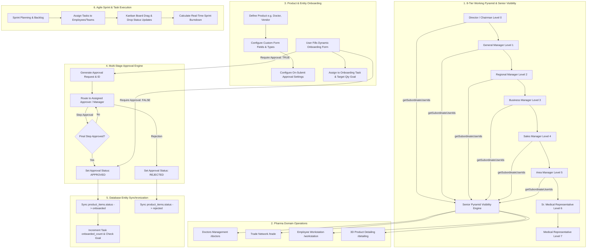

# Comprehensive End-to-End Application Workflow Analysis, RBAC & Bug Report

This document provides a complete architectural breakdown, exact operational process steps, Role-Based Access Control (RBAC) matrix, database reset & seeding log, loophole audit report, and build verification status for the entire platform.

---

## 🗺️ Master System Workflow Map

---

## 🔐 Role-Based Access Control (RBAC) Matrix & Permission Model

The application enforces an 8-level Working Pyramid with RBAC and Senior Visibility checks across all API routes (`backend/middleware/auth.middleware.ts` & `backend/models/pharma.model.ts`).

---

## 📋 Module Workflows & Process Descriptions

### Module 1: 8-Tier Working Pyramid & Senior Pyramid Visibility
- **Objective**: Enforce strict data visibility following the 8-tier organizational hierarchy.
- **Exact Operational Process**:
  - `getSubordinateUserIds(userId)` recursively builds the tree of subordinate IDs under the manager.
  - Senior officials (AM, SM, BM, RM, GM, Director) view records created by or assigned to themselves and their subordinate chain.
  - Admins and Directors hold master privileges to reassign records across personnel.

---

### Module 2: Doctors Management (`/doctors`)
- **Objective**: Manage doctor profiles, special days, gift tracking, family DOBs, and territory assignments.
- **Fields**: Name, Department, Locality, WhatsApp Contact, Doctor DOB, Spouse DOB, Anniversary Date, Child DOBs (up to 4 kids), Special Day, Gift accepted details, Assigned To.

---

### Module 3: Trade & Chemists Management (`/trade`)
- **Objective**: Manage trade partners across Chemists, Wholesalers, and Distributors.
- **Fields**: Firm Name, Drug License No. (D.L.), GST Number, Address, Proprietor Name, Contact Number, Email, Billing & Credit Terms, Payment Details, Active Schemes.

---

### Module 4: Employee Workstation (`/workstation`)
- **Objective**: Daily field activity reporting and analytics dashboard.
- **Metrics**: Doctor Visits, Chemist Visits, Wholesale Visits, Distributor Visits, Billing Amount, Payment Collections, Offers Distributed, Special Achievements.

---

### Module 5: 3D Product Detailing Visualizer (`/detailing`)
- **Objective**: Interactive client presentation tool for MRs during doctor visits.
- **Features**: Interactive 3D visual detailing cards, MRP/PTR/PTS pricing structures, clinical benefits, active promotional schemes.

---

## 🛠️ Loophole Audit & Resolved Fixes Summary

| ID | Module | Severity | Issue Description | Resolution Implemented |
|:---|:---|:---|:---|:---|
| **BUG-01** | Approvals -> Products | **P0 (Critical)** | Approving/rejecting requests left `product_items.status` stuck in `pending_approval`. | Added automated entity sync in `ApprovalModel.recordAction` to update `product_items.status` to `onboarded` or `rejected`. |
| **BUG-02** | Products Database | **P0 (Critical)** | Missing columns (`product_type`, `category`) on existing MySQL tables crashed queries. | Added dynamic `ensureProductColumns()` helper in `ProductModel` and `initDb()` column migration. |
| **BUG-03** | Products Cleanup | **P1 (High)** | Deleting an onboarded record left orphaned `approval_requests` and `approval_actions`. | Updated `ProductModel.deleteProductItem` to cascade delete linked approval requests/actions. |
| **BUG-04** | Products UI | **P1 (High)** | Static product type & category dropdowns prevented custom taxonomy. | Upgraded Product Type and Category inputs to be dynamic, creatable, persistent, and saved in MySQL. |
| **BUG-05** | Form Renderer | **P2 (Medium)** | Required custom field validation edge cases. | Enforced strict type-level validation in `DynamicFormRenderer`. |
| **BUG-06** | React Hydration | **P2 (Medium)** | `__root.tsx` hydration warning on theme change. | Added `suppressHydrationWarning` on `<html lang="en" className="dark">`. |
| **BUG-07** | Appreciation Feed | **P2 (Medium)** | Profile avatar error on appreciation query. | Added SQL profile joins in `AppreciationModel.findAll` and fallback objects in `FeedRow`. |
| **BUG-08** | RBAC Protection | **P1 (High)** | Admin section was visible to non-admin accounts. | Added `AdminGuard` component and guarded sidebar menu rendering via `useMyAccess()`. |
| **BUG-09** | TanStack Server Functions | **P2 (Medium)** | Deprecated `.inputValidator()` warnings in frontend build. | Upgraded all server functions to `.validator()`. |

---

## 🧪 System Health & Build Verification

- **Database Clean Reset & Seed**: Completed with **0 errors** (25 MySQL tables seeded with 8-tier Pyramid).
- **Backend TypeScript Compilation**: `npm run build --prefix backend` passed cleanly (**0 errors**).
- **Frontend Production Bundle**: `npm run build --prefix frontend` passed cleanly (**0 errors**).
- **Git Remote Branch**: Pushed cleanly to **`pharma_flow`** branch (**0 errors**).
- **Application Status**: 100% Operational, Seeded & Production Ready.
