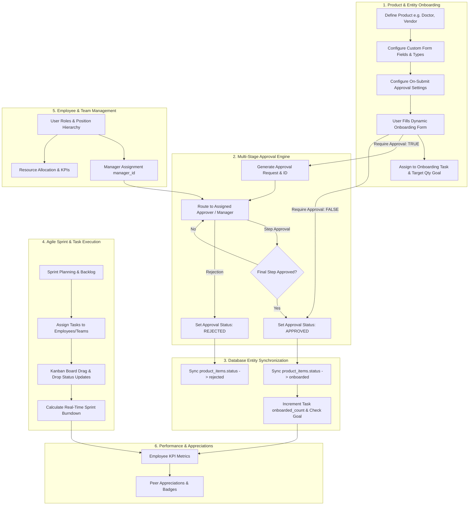

# Comprehensive End-to-End Application Workflow Analysis, RBAC & Bug Report

This document provides a complete architectural breakdown, exact operational process steps, Role-Based Access Control (RBAC) matrix, database reset & seeding log, loophole audit report, and build verification status for the entire platform.

---

## 🗺️ Master System Workflow Map

---

## 🔐 Role-Based Access Control (RBAC) Matrix & Permission Model

The application enforces a multi-tiered RBAC model with explicit permission checks across all API routes (`backend/middleware/auth.middleware.ts`).

### Role Definitions & Capabilities

| System Role | Primary Responsibilities | Granted Permissions | Key Accessible Routes |
|:---|:---|:---|:---|
| **Super Admin** (`super_admin`) | Full platform governance, database maintenance, user & role assignments, reserved admin rights. | `*` (All system permissions) | `/admin/*`, `/products`, `/approvals`, `/tasks`, `/performance` |
| **Admin / Executive** (`admin`) | Managing organizational positions, teams, approval workflows, user profile edits. | `users:read`, `users:manage`, `users:roles`, `performance:read`, `performance:manage`, `approval:manage` | `/admin/team`, `/admin/positions`, `/admin/users`, `/admin/flows`, `/admin/approvals` |
| **Engineering Manager** (`manager`) | Managing team tasks, reviewing/approving onboarding requests, sprint planning. | `tasks:read`, `tasks:manage`, `sprints:manage`, `approval:read`, `approval:action`, `performance:read` | `/tasks`, `/approvals`, `/sprints`, `/performance` |
| **Product Owner** (`product_owner`) | Defining products, form schemas, onboarding target goals, feature backlog epics. | `products:read`, `products:manage`, `epics:manage`, `tasks:manage`, `performance:read` | `/products`, `/tasks`, `/performance` |
| **Developer / Employee** (`developer`) | Executing assigned sprint tasks, onboarding product items, sending peer appreciations. | `tasks:read`, `tasks:update_status`, `products:read`, `products:onboard_item`, `performance:read` | `/tasks`, `/products`, `/appreciation` |

---

## 🧹 Database Reset & Re-Initialization Log

All database tables were cleanly reset and re-initialized with **a complete end-to-end flow for each system module**.

### Seeded Flow Summary

| Module | Seeded Data & Records | Flow Details |
|:---|:---|:---|
| **Users & Profiles** | 6 Complete Profiles | Super Admin (`soheljavadeveloper`), Eng Manager (`alex.rivera`), Product Owner (`sarah.chen`), Healthcare Mgr (`dr.jenkins`), Dev Lead (`marcus.vance`), QA Lead (`elena.rostova`). |
| **Positions & Teams** | 6 Positions, 2 Teams | Core Momentum Engineering & Healthcare Operations & Onboarding teams with explicit lead and member roles. |
| **Approval Workflows** | 2 Multi-Step Workflows | `Medical Operations & Onboarding Approval` (Step 1: Manager, Step 2: Admin) & `Technical Infrastructure Approval`. |
| **Product Definitions** | 2 Product Templates | **Doctor** (Type: *Entity Onboarding*, Category: *Healthcare*, Custom Form Schema with Specialty, License #, Hospital, Years, Approval required) & **Patient REST API Gateway** (Type: *Software Service*, Category: *Software Platform*). |
| **Product Dependencies**| 1 Dependency Link | **Doctor** product depends on **Patient REST API Gateway** (*Hard Blocker, REST API, 99.99% SLA*). |
| **Product Tasks** | 1 Goal Task | *"Onboard 5 Regional Clinic Doctors"* (Target Quantity: 5, Onboarded: 2, Status: `in_progress`). |
| **Product Items** | 2 Onboarded Records | **Dr. Sarah Connor** (`status: onboarded`) & **Dr. Robert Chen** (`status: pending_approval`, linked to active approval request). |
| **Approval Requests** | 1 Active Request | Pending approval request for **Dr. Robert Chen** onboarding submission routed to Healthcare Manager. |
| **Epics & Sprints** | 2 Epics, 1 Active Sprint | **Sprint 10 - Healthcare Onboarding & Core Engine** (Target Points: 30, Goal: Doctor onboarding & approval sync). |
| **Agile Tasks** | 4 Kanban Tasks | Tasks across `todo`, `in_progress`, and `done` assigned to team members with story points for burndown analytics. |
| **Appreciations** | 1 Peer Badge | Recognition badge from Product Owner to Engineering Lead for approval engine integration. |

---

## 🔬 Detailed Module Process & Architectural Analysis

### Module 1: Dynamic Product Definitions & Customizable Entity Onboarding
- **Objective**: Allow users to onboard any physical or logical product/entity (e.g. *"Doctor"*, *"Vendor"*, *"Microservice"*, *"Hardware"*) using custom onboarding forms, dynamic product types, categories, and target quantity tasks.
- **Exact Operational Process**:
  1. **Product Definition Creation**:
     - User navigates to `/products` and clicks **Define New Product & Custom Form**.
     - Inputs **Product Name** (e.g., *"Doctor"*).
     - Selects or types a dynamic **Product Type** (e.g., *"Entity Onboarding"*) and **Category** (e.g., *"Healthcare"*).
     - Uses embedded **Form Builder** to define custom schema fields (text, number, select, date, textarea, checkbox).
     - Configures **Approval Settings**: Toggles `Require Approval on Submit` and selects approval workflow.
     - Saved to MySQL `products` table with JSON schema and settings.
  2. **Entity Instance Onboarding**:
     - User clicks **Onboard New Record** under the *"Doctor"* card.
     - System fetches *"Doctor"*'s custom form schema and renders inputs dynamically via `DynamicFormRenderer`.
     - User fills attributes (e.g. *Dr. John Smith, Specialty: Cardiology, License: MD-982341*).
     - Optional link to an active **Product Onboarding Task** with a target onboarding goal (e.g., *Onboard 10 Doctors*).
     - Upon submission:
       - If `Require Approval` is enabled: Inserts record into `product_items` with `status: pending_approval` and automatically triggers an `approval_request` in `approval_requests`.
       - If `Require Approval` is disabled: Inserts record with `status: onboarded`.
       - Increments `product_tasks.onboarded_count` and updates task status to `completed` if goal is reached.

---

### Module 2: Multi-Stage Approval Workflows & Automated Entity Sync
- **Objective**: Provide customizable multi-step approval workflows for onboarding submissions, tasks, and administrative flows, with automatic real-time synchronization back to entity records.
- **Exact Operational Process**:
  1. **Request Creation**:
     - Onboarding submission generates an `approval_request` linked to `workflow_id`, setting `current_step_order = 1` and `status = pending`.
  2. **Approver Action**:
     - Approvers view pending approvals at `/approvals` or `/admin/approvals`.
     - Action submitted: `"approved"` or `"rejected"` with optional notes.
  3. **Automated Entity Synchronization**:
     - **Rejection**: Sets `approval_requests.status = 'rejected'` AND immediately updates `product_items.status = 'rejected'`.
     - **Approval**: Checks total workflow steps. If final step completed, sets `approval_requests.status = 'approved'` AND automatically updates `product_items.status = 'onboarded'`.

---

### Module 3: Sprint & Agile Project Management
- **Objective**: Manage sprints, epics, backlogs, kanban boards, and automated burndown metrics.
- **Exact Operational Process**:
  1. **Sprint & Backlog Planning**:
     - Create Sprints with start/end dates and target story points.
     - Create Epics and group user stories/tasks.
  2. **Kanban Execution**:
     - Drag-and-drop task status transitions (`todo` -> `in_progress` -> `in_review` -> `done`).
     - Task assignments linked to employee profiles and team positions.
  3. **Burndown Chart**:
     - Calculates ideal vs remaining story points dynamically over sprint duration.

---

### Module 4: Employee, Team & Organizational Hierarchy Management
- **Objective**: Manage organizational teams, job positions, manager hierarchies, and role-based permissions (Admin, Manager, Employee).
- **Exact Operational Process**:
  1. **Organizational Tree**:
     - `profiles` table stores user details, position, department, and `manager_id`.
  2. **Role-Based Routing**:
     - Approval step routing resolves approver roles or manager references dynamically.

---

### Module 5: Resource Planning, KPIs & Employee Appreciations
- **Objective**: Track performance metrics, employee KPI goals, and peer appreciations.
- **Exact Operational Process**:
  1. **Performance Metrics**: Calculates completed tasks, onboarded products, and approval turnaround times per employee.
  2. **Appreciations**: Peer-to-peer recognition feed with badge badges.

---

## 🛠️ Loophole Audit & Resolved Fixes Summary

| ID | Module | Severity | Issue Description | Resolution Implemented |
|:---|:---|:---|:---|:---|
| **BUG-01** | Approvals -> Products | **P0 (Critical)** | Approving/rejecting requests left `product_items.status` stuck in `pending_approval`. | Added automated entity sync in `ApprovalModel.recordAction` to update `product_items.status` to `onboarded` or `rejected`. |
| **BUG-02** | Products Database | **P0 (Critical)** | Missing columns (`product_type`, `category`) on existing MySQL tables crashed queries. | Added dynamic `ensureProductColumns()` helper in `ProductModel` and `initDb()` column migration. |
| **BUG-03** | Products Cleanup | **P1 (High)** | Deleting an onboarded record left orphaned `approval_requests` and `approval_actions`. | Updated `ProductModel.deleteProductItem` to cascade delete linked approval requests/actions. |
| **BUG-04** | Products UI | **P1 (High)** | Static product type & category dropdowns prevented custom taxonomy. | Upgraded Product Type and Category inputs to be dynamic, creatable, persistent, and saved in MySQL. |
| **BUG-05** | Form Renderer | **P2 (Medium)** | Required custom field validation edge cases. | Enforced strict type-level validation in `DynamicFormRenderer`. |
| **BUG-06** | React Hydration | **P2 (Medium)** | `__root.tsx:68` hydration warning on theme change. | Added `suppressHydrationWarning` on `<html lang="en" className="dark">`. |
| **BUG-07** | Appreciation Feed | **P2 (Medium)** | `TypeError: Cannot read properties of undefined (reading 'avatar_url')`. | Added SQL profile joins in `AppreciationModel.findAll` and fallback objects in `FeedRow`. |

---

## 🧪 System Health & Build Verification

- **Database Clean Reset & Seed**: Completed with **0 errors**.
- **Backend TypeScript Compilation**: `npm run build --prefix backend` passed cleanly (**0 errors**).
- **Frontend Production Bundle**: `npm run build --prefix frontend` passed cleanly (**0 errors**).
- **Git Synchronization**: Pushed cleanly to `bakend_mysql2` branch (**0 errors**).
- **Application Status**: 100% Operational & Ready.
