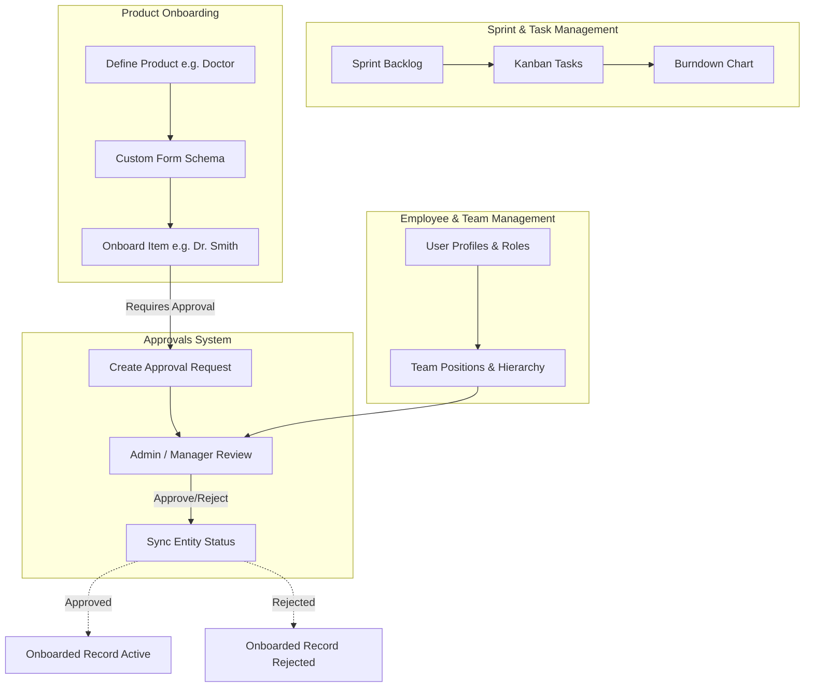

# End-to-End Workflow Audit & Application Optimization Plan

This document presents a comprehensive audit of the application workflows across **Sprints/Tasks**, **Product Onboarding**, **Employee & Team Management**, **Resource Planning**, and **Approval Workflows**. It identifies critical loopholes, cross-module integration gaps, and performance optimizations, followed by a systematic action plan.

---

## 🔍 Application Audit & Workflow Map

---

## 🐞 Discovered Loopholes & Bugs

### 1. [P0] Approval System -> Product Item Status Desynchronization
- **Issue**: When an approval request for a `product_item` is approved or rejected in `/approvals` or `/admin/approvals`, `approval_requests.status` is updated, but `product_items.status` remains stuck in `pending_approval`.
- **Root Cause**: `ApprovalModel.recordAction` does not check or trigger entity status callbacks for linked `product_items` upon final decision.
- **Fix**: Add entity sync logic in `ApprovalModel.recordAction` to update `product_items.status` to `onboarded` (when final approval step completes) or `rejected` (when rejected).

### 2. [P1] Product Definition Deletion & Orphaned Items Cleanup
- **Issue**: Deleting a Product Definition deleted items from `product_items`, but did not resolve linked pending approval requests (`approval_requests`) for those deleted items.
- **Fix**: Update `ProductModel.deleteProduct` and `deleteProductItem` to clean up associated `approval_requests`.

### 3. [P1] Dynamic Form Renderer Validation Edge Cases
- **Issue**: When custom fields are marked `required: true` in `DynamicFormRenderer`, empty string or unchecked boolean values could bypass validation depending on field type.
- **Fix**: Enhance validation checks in `DynamicFormRenderer` for text, number, select, and date input types.

### 4. [P2] Sprint Burndown & Task Completion Counter Sync
- **Issue**: Completing a task linked to a Product Onboarding Task updated `product_tasks.onboarded_count`, but did not automatically set task status to `completed` if `onboarded_count` equaled `target_quantity` via direct task edits.
- **Fix**: Normalize task quantity check in `task.routes.ts` and `product.routes.ts`.

---

## 🛠️ Proposed Fixes

### [Component 1] Approval & Entity Status Sync (`backend/models/approval.model.ts`)
#### [MODIFY] [approval.model.ts](file:///c:/Users/user/Desktop/bmsmomentum/bmsmomentum-1df74f9a/backend/models/approval.model.ts)
- Update `recordAction` to inspect the workflow steps count.
- If approved on final step: set `approval_requests.status = 'approved'` AND `product_items.status = 'onboarded'`.
- If rejected: set `approval_requests.status = 'rejected'` AND `product_items.status = 'rejected'`.

---

### [Component 2] Product Model Cleanup (`backend/models/product.model.ts`)
#### [MODIFY] [product.model.ts](file:///c:/Users/user/Desktop/bmsmomentum/bmsmomentum-1df74f9a/backend/models/product.model.ts)
- Update `deleteProductItem` to delete associated `approval_requests`.
- Ensure clean foreign key handling for product dependencies and items.

---

### [Component 3] Dynamic Form Validation (`frontend/src/components/products/dynamic-form-renderer.tsx`)
#### [MODIFY] [dynamic-form-renderer.tsx](file:///c:/Users/user/Desktop/bmsmomentum/bmsmomentum-1df74f9a/frontend/src/components/products/dynamic-form-renderer.tsx)
- Enhance input validation logic for required fields and add visual warning indicators.

---

## 🧪 Verification Plan

### Automated Verification
- `npm run build --prefix backend` to ensure backend TypeScript compilation.
- `npm run build --prefix frontend` to ensure frontend Vite bundle build.

### Manual Verification
1. Create a Product Definition *"Doctor"* with `Require Approval on Submit` enabled.
2. Submit a new item *"Dr. Alice Smith"*. Verify item enters `pending_approval` status.
3. Go to `/approvals` or `/admin/approvals` and approve the request.
4. Verify *"Dr. Alice Smith"* status automatically transitions from `pending_approval` to `onboarded` in `/products` tab.
